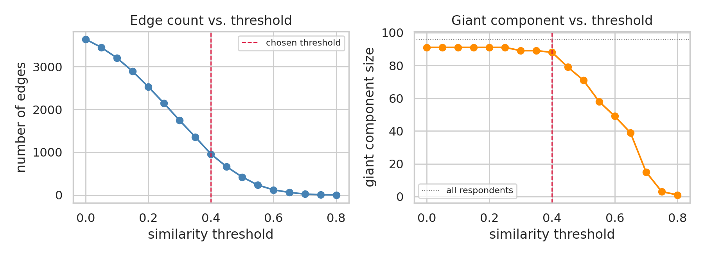
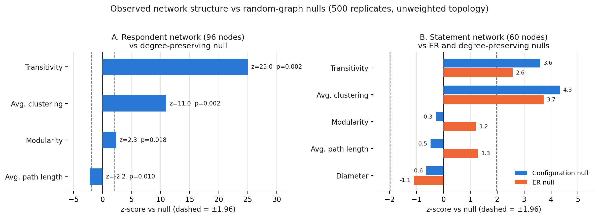
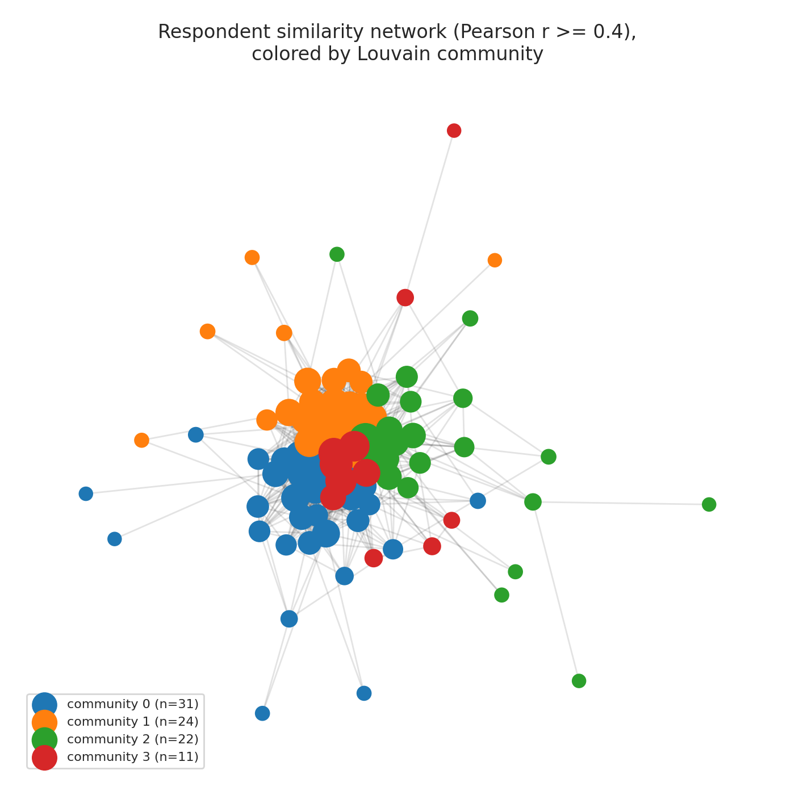
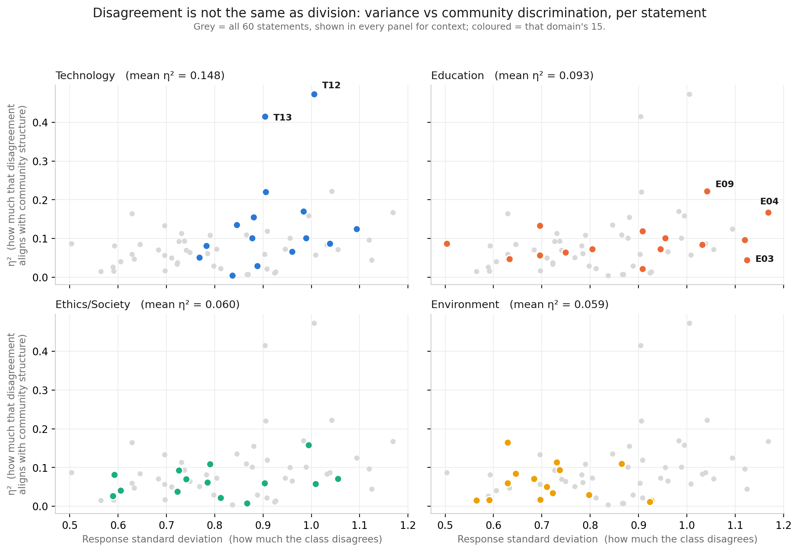
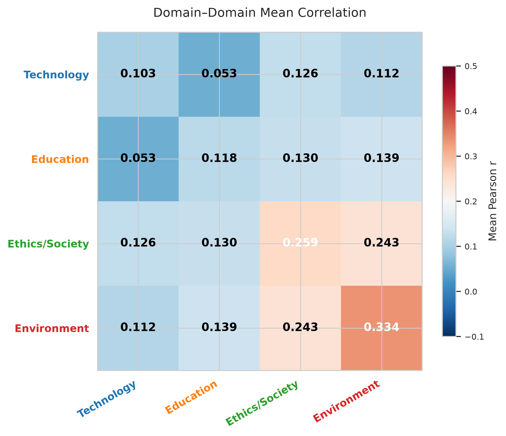
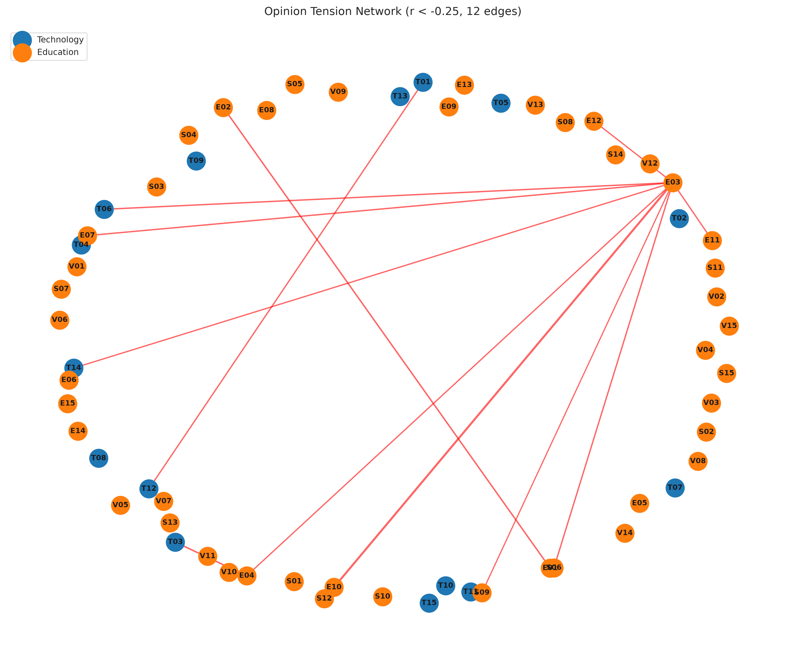
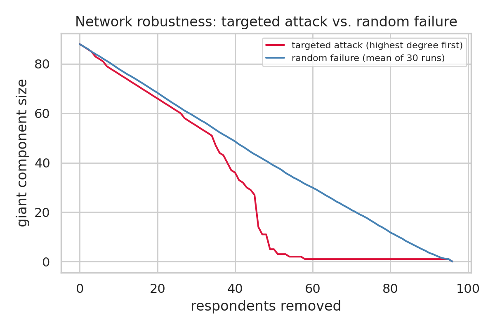

# Opinion Network Formation from a Class Survey

**Team Name:** _[TODO — fill in]_

**GitHub:** _[TODO — repository URL]_

---

## 1. Dataset Documentation

### 1.1 What the data is

The survey collected **96 responses** to **60 Likert statements**, evenly split across four
declared domains of 15 statements each:

| Prefix | Domain | Items |
|---|---|---|
| T | Technology | T01–T15 |
| E | Education | E01–E15 |
| S | Ethics/Society | S01–S15 |
| V | Environment | V01–V15 |

### 1.2 Encoding

The five-point ordinal scale was mapped to a symmetric integer scale so that means,
variances and correlations are defined and the neutral point sits at zero:

| Response | Value |
|---|---|
| Strongly Disagree | −2 |
| Disagree | −1 |
| Neutral | 0 |
| Agree | +1 |
| Strongly Agree | +2 |

Blank cells and the literal response `"No Comments"` were both treated as **missing**
(`NaN`) rather than as neutral. This distinction matters: coding "No Comments" as 0
would have manufactured artificial agreement between non-responders, inflating
similarity edges between exactly the respondents we know least about.

### 1.3 Missingness

542 of 5 760 cells (**9.41%**) are missing, but the missingness is highly concentrated
rather than spread evenly:

- **5 respondents (IDs 44, 60, 68, 73, 78) answered nothing at all** — all 60 items missing.
- 4 respondents (30, 39, 77, 87) are missing 45 of 60.
- The remaining ~60 missing cells are scattered singletons across 19 respondents.

Consequence for the network: the 5 empty respondents have no defined correlation with
anyone and necessarily appear as **isolated nodes**. They are retained as nodes so that
node counts stay honest, but they contribute no edges. This fully accounts for 5 of the
8 isolates observed later at the chosen threshold.

All correlations use **pairwise-complete observations**, so a pair of respondents is
compared on whatever items they both answered rather than dropping any respondent with
a single gap.

### 1.4 Do the four declared domains hold together?

Before building anything we checked whether the survey's own four labels describe
coherent constructs, using Cronbach's α on each 15-item block:

| Domain | Cronbach's α | Reading |
|---|---|---|
| Environment | **0.868** | Good internal consistency |
| Ethics/Society | **0.824** | Good |
| Technology | 0.649 | Questionable |
| Education | **0.579** | Poor |

Environment and Ethics/Society behave like genuine attitude scales. Technology and
especially Education do not — their 15 items do not measure one underlying opinion.
This is the first hint of a result that the network analysis later confirms
independently (§3.5), and it is the reason we did not simply collapse each domain into
a single score.

### 1.5 Response-quality screening

We screened for straight-lining and careless responding using per-respondent trace
metrics (number of distinct values used, modal-response share, standard deviation,
longest run of identical answers). Five respondents were flagged: **41, 90, 91, 94, 110**
— e.g. respondent 110 gave the same answer 42 times in a row, and respondent 41 used one
option for 87% of items.

**We chose to retain them**, and verified after the fact that this was safe. A
straight-liner has near-zero variance, so their correlation with anyone is poorly
defined and tends toward zero — they should surface as low-degree peripheral nodes, not
as artificial hubs. Their degrees in the final network sit at percentiles 0.52, 0.61,
0.67, 0.78 and 0.95 against a median degree of 17.5, i.e. unremarkable. Only respondent
90 is mildly central, not enough to distort structure. Removing them changes no
conclusion in this report.

---

## 2. Pipeline Followed

We built **two complementary networks** from the same encoded matrix, because they
answer different questions.

```
Survey_Results_UC.csv  (96 × 60 raw Likert strings)
          │
          ├─ encode to −2..+2, blanks & "No Comments" → NaN
          │
          ├── NETWORK A: RESPONDENT SIMILARITY  (primary)
          │     nodes   = 96 respondents
          │     weight  = Pearson r between their 60-dim answer vectors
          │     sparsify= keep edges with r ≥ 0.40  (justified in §2.2)
          │     → 957 edges, then Louvain communities + ANOVA profiling
          │
          └── NETWORK B: STATEMENT CORRELATION  (secondary)
                nodes   = 60 statements
                weight  = Pearson r between statement columns
                sparsify= top-K (K=3) strongest positive neighbours per node
                → 136 edges, then Louvain communities vs declared domains
                also: negative-edge "tension" network at r < −0.25
```

### 2.1 Why two networks

Network A treats **people** as nodes and answers *"are there opinion camps in this
class, and what do they believe?"* Network B treats **statements** as nodes and answers
*"do opinions cluster the way the survey assumes they do?"* Neither question can be
answered from the other network, so both are reported.

### 2.2 Choosing the similarity threshold

The 96 respondents give 4 091 pairwise correlations: mean r = **0.252**, sd = 0.200,
range −0.676 to +0.774. The distribution is positive-shifted — the class broadly agrees
with itself — which means a threshold is needed or the graph is a near-complete blob.

The threshold is the single most consequential arbitrary choice in the pipeline, so we
swept it and read off the percolation behaviour rather than picking a round number.



**Figure 1.** Edge count (left) and giant-component size (right) as the similarity
threshold varies. The dashed line marks the chosen value, r ≥ 0.40.

The giant component sits on a plateau at ~90 nodes for all thresholds up to ≈0.40 and
then falls away steeply; edge count decays smoothly throughout. **r ≥ 0.40 is the last
point before fragmentation** — the sparsest graph that still keeps essentially the whole
class in one connected structure. Above it the network shatters and any community
analysis would be describing the shattering, not the opinions.

Resulting network: **96 nodes, 957 edges, density 0.210, mean degree 19.94, average
clustering 0.510, 9 components with a giant component of 88, and 8 isolates** (5 of
which are the empty respondents of §1.3).

### 2.3 Statement network construction

For Network B a global threshold performs badly, because statement–statement
correlations are weak and unevenly distributed: a single cutoff either keeps almost
nothing or keeps the Environment block only. We instead used **top-K sparsification**
(K = 3): each statement connects to its three most strongly positively correlated
partners, and the union of those links forms the graph. This guarantees every statement
participates and makes the resulting structure a statement's *relative* affinities
rather than an absolute correlation level.

Result: **60 nodes, 136 edges, density 0.077, mean degree 4.53, transitivity 0.122,
modularity 0.441.**

---

## 3. Analysis and Visualizations

### 3.1 Is there structure at all? Null-model validation

Any similarity graph looks clustered. Before interpreting anything we compared both
networks against 500 random-graph replicates each: an **Erdős–Rényi** null (same node
and edge count) and a **configuration-model** null (same node count *and* same degree
sequence — the stricter test, since it asks whether structure survives after the degree
distribution is accounted for).



**Figure 2.** Standardised deviation of each observed metric from its null distribution.
Dashed lines mark ±1.96 (the 5% two-sided significance band). Panel A: respondent
network against the degree-preserving null. Panel B: statement network against both
nulls.

| Network | Metric | Observed | Null mean | z | p |
|---|---|---|---|---|---|
| Respondent | Transitivity | 0.595 | 0.361 | **+25.0** | 0.002 |
| Respondent | Avg. clustering | 0.510 | 0.317 | **+11.0** | 0.002 |
| Respondent | Modularity | 0.162 | 0.148 | **+2.31** | **0.018** |
| Respondent | Avg. path length | 1.997 | 2.029 | −2.24 | 0.010 |
| Statement | Transitivity (config) | 0.122 | 0.061 | **+3.60** | 0.002 |
| Statement | Avg. clustering (config) | 0.153 | 0.063 | **+4.33** | 0.002 |
| Statement | Modularity (config) | 0.441 | 0.445 | −0.28 | 0.840 |
| Statement | Modularity (ER) | 0.441 | 0.422 | +1.21 | 0.230 |

Two findings, and they pull in different directions:

1. **Clustering is overwhelmingly real.** The respondent network is transitive far
   beyond chance (z = +25.0). Opinion similarity is strongly *triadic*: if A agrees with
   B and B agrees with C, then A and C agree far more often than degree alone predicts.
   The same holds, more modestly, for statements (z = +3.60).
2. **Modularity is only marginally real.** The respondent partition beats its null, but
   by 9% of the null mean (z = +2.31, p = 0.018) — statistically significant, but a weak
   effect. The **statement** network's modularity of 0.441 sounds impressive and is
   entirely unremarkable: a degree-matched random graph achieves 0.445 (p = 0.84). A
   high modularity score on a sparse top-K graph is an artifact of sparsity, not
   evidence of communities.

The sparsity artifact is directly visible in the construction parameter. Rebuilding the
statement network at K = 2, 3 and 5 gives modularity **0.590 → 0.441 → 0.340**: the
score falls monotonically as the graph gets denser, tracking the number of edges rather
than any change in the underlying opinions. A modularity value read without a null
model is largely a report of how aggressively the graph was sparsified.

This is the single most important methodological caveat in the report and it governs how
strongly we are willing to phrase everything that follows.

> **Note on reproducibility.** The null-model figures in `Aryan/figures/` compare a
> *weighted* observed path length against *unweighted* nulls and are therefore not valid;
> the numbers above are recomputed on unweighted topology on both sides by
> `report/recompute_nulls.py` and `report/respondent_nulls.py`. See §6.

### 3.2 Community structure among respondents

Louvain on the respondent network returns **4 substantial communities** (n = 31, 24, 22,
11) plus 8 singletons, which are the isolates of §1.3 and are excluded from all
community-level statistics.



**Figure 3.** The respondent similarity network at r ≥ 0.40, coloured by Louvain
community. The visual impression — one dense core with communities as adjacent
neighbourhoods rather than separated blobs — is exactly what the modularity z-score
predicts.

**Are these communities separable?** Yes, measurably. For every one of the six community
pairs, mean cross-community similarity is below both within-community values:

| Pair | within *i* | within *j* | cross | cosine of mean belief vectors | items with \|d\| > 0.8 |
|---|---|---|---|---|---|
| A–B | 0.336 | 0.395 | 0.259 | 0.948 | 6 |
| A–C | 0.336 | 0.259 | 0.184 | 0.937 | 6 |
| A–D | 0.336 | 0.388 | 0.282 | 0.953 | 7 |
| B–C | 0.395 | 0.259 | 0.246 | 0.954 | 4 |
| B–D | 0.395 | 0.388 | 0.311 | 0.948 | **13** |
| C–D | 0.259 | 0.388 | 0.252 | 0.954 | 7 |

(A = 31, B = 24, C = 22, D = 11 members, corresponding to communities 0–3 in Figure 3.)

**But are they *different*?** Barely. The cosine similarity between any two communities'
mean 60-dimensional belief vectors is **0.937–0.954**. Geometrically the four camps point
in almost the same direction in opinion space; they differ in *magnitude and emphasis*,
not in what they are for and against. Only 4–13 of 60 statements reach a large effect
size on any given pair.

### 3.3 What actually divides the communities

Pairwise Cohen's *d* only compares two groups at a time. To rank *every* statement by how
well it separates all four communities simultaneously we used a one-way **ANOVA** and
report **η²** — the fraction of that statement's variance explained by community
membership.

| Rank | Statement | F | p | η² |
|---|---|---|---|---|
| 1 | **T12.** Governments should introduce stricter regulations for AI | 24.77 | 1.5e−11 | **0.472** |
| 2 | **T13.** Cybersecurity deserves greater investment than new digital tech | 19.39 | 1.4e−09 | **0.415** |
| 3 | E09. Collaborative learning is more effective than individual learning | 7.53 | 1.7e−04 | 0.222 |
| 4 | T05. AI will significantly accelerate scientific discovery | 7.90 | 1.1e−04 | 0.220 |
| 5 | T01. AI will improve society more than it creates problems | 5.72 | 1.3e−03 | 0.170 |
| 6 | E04. High-quality online learning can complement classroom teaching | 5.37 | 2.0e−03 | 0.168 |
| 7 | V01. Climate change requires immediate global action | 5.20 | 2.5e−03 | 0.165 |
| 8 | S04. Tech companies should be accountable for platform misuse | 5.02 | 3.1e−03 | 0.158 |

**Two statements dominate.** T12 and T13 explain 47% and 42% of their own variance
through community membership; the third-placed item manages 22%. The class's community
structure is, to a first approximation, *a disagreement about technology governance* —
and nothing else.

Mean scores on the top six separating statements make the camps concrete:

| Statement | **A** (n=31) | **B** (n=24) | **C** (n=22) | **D** (n=11) |
|---|---|---|---|---|
| T12. Stricter AI regulation | **0.19** | 1.43 | **1.68** | 1.55 |
| T13. Cybersecurity over new tech | **0.20** | **1.61** | 1.18 | 1.36 |
| E09. Collaborative > individual learning | 0.63 | **1.50** | **0.19** | 0.82 |
| T05. AI accelerates science | 1.35 | **0.58** | 1.50 | **1.73** |
| T01. AI improves society net-positive | **1.03** | **0.00** | 0.68 | 0.73 |
| E04. Online learning complements class | **1.07** | 0.33 | **−0.14** | 0.36 |

Reading the camps off the numbers:

- **Community A (n = 31) — "techno-optimists".** The only group not calling for AI
  regulation (0.19 vs 1.43–1.68) or prioritising cybersecurity (0.20 vs 1.18–1.61).
  Highest on AI being net-positive for society (1.03) and most favourable to online
  learning (1.07). This is the single largest camp and the one genuine dissenting
  position in the class.
- **Community B (n = 24) — "cautious regulators".** Strongest on cybersecurity (1.61)
  and collaborative learning (1.50), but the *only* group neutral on whether AI improves
  society (0.00) and the most sceptical that AI will accelerate science (0.58). Pro-
  governance, unconvinced by the technology itself.
- **Community C (n = 22) — "regulate-but-embrace".** Highest demand for AI regulation
  (1.68) while still believing AI accelerates science (1.50). Distinctly traditionalist
  on pedagogy: lowest on collaborative learning (0.19) and the only group *negative* on
  online learning (−0.14).
- **Community D (n = 11) — "enthusiastic regulators".** Highest of all on AI
  accelerating science (1.73) combined with strong support for regulation (1.55).
  Moderate elsewhere. Smallest and least distinctive camp.

Crucially, **all four camps sit on the agreement side of nearly every Ethics/Society and
Environment statement**. The divisions above are variations within a shared consensus,
which is precisely why the cosine similarities in §3.2 are so high.

### 3.4 Disagreement is not the same as division

A natural objection to §3.3 is that T12 and T13 might top the ranking simply because
they are the statements people disagree about most — that η² is just measuring variance.
It is not, and testing this produces the report's sharpest result.

We regressed each statement's discriminating power (η² from §3.3) on its raw response
standard deviation across all 60 items. The two are related, but only weakly:
**Pearson r = 0.306 (p = 0.018), Spearman ρ = 0.318** — variance explains roughly **9%**
of discriminating power. Which statements divide the class into *camps* is largely
independent of which statements the class *disagrees about*.



**Figure 4.** Each statement's response variance (x) against how much of its variance is
explained by community membership (y), facetted by domain. All 60 statements appear in
grey in every panel for reference. A statement high on the x-axis is *contested*; a
statement high on the y-axis is *factional*. These are clearly different properties.

The domain means make the separation explicit:

| Domain | Mean response sd | Mean η² | Max η² |
|---|---|---|---|
| Technology | 0.917 | **0.148** | **0.472** |
| Education | 0.886 | 0.093 | 0.222 |
| Ethics/Society | 0.804 | 0.060 | 0.158 |
| Environment | 0.724 | 0.059 | 0.165 |

**Technology and Education generate almost identical amounts of disagreement (sd 0.917 vs
0.886) but Technology's disagreement is twice as factional** (mean η² 0.148 vs 0.093).
Controlling for variance directly: of the statements with sd > 0.9, the 8 Technology
items average η² = 0.207 while the 9 Education items average η² = 0.103. At matched
levels of disagreement, Technology divides the class into groups and Education does not.

The cleanest single illustration is E03, "Class attendance should be compulsory":

| Statement | Rank by variance | Rank by η² | η² |
|---|---|---|---|
| **E03.** Compulsory attendance | **2 of 60** | **44 of 60** | 0.045 |
| **T13.** Cybersecurity over new tech | 22 of 60 | **2 of 60** | 0.415 |
| **T12.** Stricter AI regulation | 10 of 60 | **1 of 60** | 0.472 |

E03 is the second most contested statement in the entire survey and the 44th most
factional. T13 is the reverse: only middling disagreement, but almost perfectly aligned
with community structure.

**Interpretation.** These are two genuinely different kinds of disagreement, and
conflating them is the standard error in survey analysis. Education produces
**idiosyncratic** disagreement — people differ, but they differ individually, and
knowing someone's community tells you almost nothing about their view on attendance or
examinations. Technology produces **structured** disagreement — comparatively modest in
magnitude, but aligned, so that a single position (on AI regulation) predicts a cluster
of others. Only the second kind builds communities. A class can argue loudly about
attendance without that argument organising anybody into a camp, which is exactly what
the numbers show it does.

This also explains why the camps in §3.3 are defined by Technology items: **the top six
separating statements are all Technology or Education, with zero from Ethics/Society or
Environment.** Ethics and Environment are where the class agrees (mean scores +1.28 and
+1.39, the highest of the four domains), and a statement everyone endorses cannot
separate anybody, however important it is. The consensus domains are substantively the
class's strongest convictions and simultaneously its least informative signal.

### 3.5 Do opinions organise the way the survey assumes?

Network B tests the survey's own four-domain structure. Mean within- and between-domain
correlations:



**Figure 5.** Mean Pearson correlation within and between the four declared domains.
Diagonal = internal coherence of each domain.

| Domain | Mean within-domain r | Cronbach's α (§1.4) |
|---|---|---|
| Environment | **0.334** | 0.868 |
| Ethics/Society | **0.259** | 0.824 |
| Education | 0.118 | 0.579 |
| Technology | 0.103 | 0.649 |

Two independent methods — a network-derived correlation statistic and a classical
psychometric reliability coefficient — produce the **same ordering**. That agreement is
worth more than either number alone.

The decisive cell is off-diagonal: **Ethics/Society ↔ Environment correlate at 0.243**,
which is *higher than the internal coherence of either Technology (0.103) or Education
(0.118)*. Two statements from different declared domains are more related than two
statements from within the same declared domain.

Louvain on the statement network confirms it: the detected communities score
**ARI = 0.059** against the declared T/E/S/V labels — essentially zero agreement. The
largest detected community mixes Ethics and Environment items ("Leaders should prioritize
ethical decision-making", "Companies should be held accountable for environmental
impacts", "Products should be designed for reuse and repair") into one
civic-responsibility cluster that the survey's taxonomy splits in two.

A third, independent statistic agrees. Ranking all 60 statements by response variance
and taking the extremes, the composition is lopsided in opposite directions:

| Group | Technology | Education | Ethics/Society | Environment |
|---|---|---|---|---|
| 10 most contested statements | 3 | **5** | 2 | 0 |
| 10 most consensual statements | 0 | 2 | 3 | **5** |

Not one Environment statement appears among the ten most contested, and not one
Technology statement among the ten most consensual. Mean agreement scores order the same
way: Environment **+1.39**, Ethics/Society **+1.28**, Technology +0.99, Education +0.91.
This uses variance rather than correlation, so it is not a restatement of the heatmap —
it is a third method reaching the same conclusion about which domains are real.

**Interpretation.** Opinions organise by *stance*, not by *topic*. "Environmental
responsibility" and "ethical accountability" are one attitude in this class.
"Technology" and "Education" are not attitudes at all — they are labels over several
unrelated sub-debates (AI capability vs. AI governance vs. privacy; pedagogy vs.
assessment vs. attendance), which is exactly why their internal correlations are low.
Given §3.1, we present this as a statement about *correlation structure*, not as
evidence of distinct statement communities.

### 3.6 Where the class actually disagrees: the tension network

Nearly all statement correlations are positive. Extracting the **negative** edges
(r < −0.25) isolates genuine opposition, and there is strikingly little of it: **12
negative edges in the entire 60-node network**.



**Figure 6.** The opinion-tension network: statements joined when their responses are
negatively correlated at r < −0.25. Almost all tension routes through a single node.

**Nine of those twelve edges involve one statement: E03, "Class attendance should be
compulsory for all courses."**

| Partner statement | r |
|---|---|
| E10. Universities should prioritize innovation over rote learning | **−0.440** |
| E04. High-quality online learning complements classroom teaching | −0.276 |
| E07. Publishing research before graduation should be encouraged, not mandatory | −0.297 |
| E11. Curricula should be updated more frequently | −0.279 |
| E12. AI should be integrated into teaching | −0.277 |
| S06. Combating misinformation is a shared responsibility | −0.292 |
| S09. Universities should promote inclusive viewpoint discussion | −0.257 |
| T06. Repetitive jobs will be replaced by automation | −0.302 |
| T14. Social media algorithms contribute to polarization | −0.279 |

E03 is also the least-endorsed statement in the survey by a wide margin — **only 11 of 96
respondents agree**, against 28 for the next-lowest — and has the second-highest response
variance of all 60 items.

**Interpretation.** Compulsory attendance is this class's ideological litmus test.
Supporting it anti-correlates with essentially the entire progressive-education cluster
*and* with several Technology and Ethics positions — it is the only statement in the
survey that is genuinely *opposed* to a broad set of others rather than merely
uncorrelated with them.

But §3.4 adds a crucial qualification that the tension network alone would hide: E03
ranks **44th of 60** in discriminating between the four communities (η² = 0.045). The
attendance divide is real, it is the sharpest opposition in the data, and it **cuts
across the communities rather than between them**. Every camp contains both its
supporters and its opponents. This is why E03 dominates Figure 6 yet is absent from the
separating-statement ranking in §3.3 — the two analyses are measuring different things,
and only together do they give the right answer.

Note also that polarization here is **localised to a single item** — 12 negative edges
out of 1 770 possible statement pairs — rather than being a global property of the
network. Given how readily "polarization" is claimed of survey data, this is an
important negative result.

### 3.7 Agreement vs correlation: does the construction choice matter?

Both networks so far define similarity by *correlation*, which credits two respondents
who disagree together just as much as two who agree together. As a cross-check we built
a **bipartite respondent–statement network** using a different notion entirely: an edge
wherever a respondent agrees with a statement (score ≥ 1), then projected onto each side.

The bipartite graph has **density 0.723** — the average respondent actively agrees with
43 of 60 statements. This quantifies the acquiescence already visible in §2.2's
positive-shifted correlation distribution and is the single clearest statement of the
report's overall finding: this is an agreeable class, and the analysis is looking for
structure inside a large shared consensus rather than between opposed blocs.

Two results from the projections:

- **Construction choice changes the camps.** Louvain on the co-agreement projection
  versus Louvain on the correlation network agree at only **ARI = 0.151**. Two defensible
  definitions of "similar respondents" produce nearly unrelated partitions. This is
  independent corroboration of §3.9's finding that community *membership* is not a
  robust object, and it arises from the network definition rather than the algorithm.
- **Bridge statements.** In the statement co-endorsement projection, betweenness and the
  Guimerà–Amaral participation coefficient both single out **T08, "AI-assisted diagnosis
  should become routine in healthcare"** (betweenness 0.357 — twice the next statement;
  participation 0.356) and **E13, "Universities should invest more in research than
  infrastructure"** (0.177, 0.347). Both are also among the least-endorsed items (34 and
  32 of 96). These are the statements whose supporters are drawn from otherwise separate
  opinion clusters — concrete, low-variance issues that cut across the class's broader
  alignments instead of following them.

### 3.8 Robustness of the network to losing respondents

We removed nodes one at a time under two regimes — **targeted** (always the current
highest-degree node) and **random** (averaged over 30 orders) — and tracked the giant
component.



**Figure 7.** Giant-component size under targeted attack vs random failure.

Halving the giant component takes **35 targeted removals vs 41 random** — a 15%
difference. For comparison, a hub-dominated (scale-free) network typically collapses
under targeted attack after removing a few percent of nodes. The two curves here track
each other closely through the first ~30 removals and separate only in the tail, where
the targeted curve fully fragments by ~58 removals while random failure degrades roughly
linearly.

**Interpretation.** There are no structurally load-bearing respondents. Class opinion
cohesion is a distributed property, not something held together by a handful of
"consensus" individuals — consistent with the very high transitivity (§3.1) and with the
high-degree respondents differing from the median only in degree, not in kind.

### 3.9 Robustness of the communities themselves

Because §3.1 showed modularity is only marginally above chance, we stress-tested the
partition directly. Adjusted Rand Index (ARI) measures partition agreement; 1.0 is
identical, 0 is chance.

| Perturbation | ARI vs baseline | Verdict |
|---|---|---|
| Louvain seed (10 seeds, pairwise mean) | 0.662 (range 0.449–1.000) | Moderately stable |
| Louvain vs greedy modularity | 0.675 | Moderately stable |
| Threshold r ≥ 0.35 | 0.482 | Sensitive |
| Threshold r ≥ 0.45 | 0.371 | Sensitive |
| Item weighting: uniform vs sd-weighted | 0.535 | Sensitive |
| Item weighting: uniform vs bimodality-weighted | 0.599 | Sensitive |
| **Louvain vs label propagation** | **0.105** | **Unstable** |
| **Correlation vs co-agreement construction (§3.7)** | **0.151** | **Unstable** |

We also tested a **discrimination-weighted** alternative construction, in the spirit of
item-response theory: statements that split the sample should count more toward
similarity than statements everyone already agrees on. Networks were built at matched
edge counts (958 edges) so that weighting effects are not confounded with density. The
weighting **changes almost nothing that matters**: eigenvector-centrality rankings
correlate at Spearman ρ = 0.985–0.990 across all three schemes, and T12/T13 remain the
top two separating statements under every weighting. It reshuffles 29 of 96 community
labels without changing any substantive conclusion.

**Honest verdict.** The *membership* of the four communities is not reproducible — under
algorithm choice (ARI 0.105) or under network definition (ARI 0.151) it degrades to
barely above chance. What *is* reproducible is the **axis** of division: T12 and T13 top
the separating-statement ranking under every weighting scheme, every threshold, and both
algorithms. We therefore report the **dividing dimension** as the finding and the
**specific membership** as provisional. Readers should take "community A believes X" in
§3.3 as a description of a region of opinion space, not a roster.

---

## 4. Results and Discussion

**1. The class is one broad consensus with gradations, not a set of factions.**
Communities are statistically separable (cross-community similarity is 20–45% below
within-community for all six pairs) and marginally more modular than chance (z = +2.31,
p = 0.018), yet their mean belief vectors have cosine similarity 0.937–0.954. They
differ in emphasis, not direction. Any report claiming "four distinct opinion camps"
from this data would be overreading it.

**2. The one real fault line is technology governance.** T12 (AI regulation, η² = 0.472)
and T13 (cybersecurity investment, η² = 0.415) explain roughly twice as much
between-community variance as any other statement. A single 31-person community declines
to endorse either (0.19 and 0.20, against 1.18–1.68 elsewhere) while remaining the most
optimistic about AI's societal impact. That trade-off — enthusiasm paired with
scepticism about regulation — is the primary structure in this dataset.

**3. Loud disagreement and group division are different phenomena, and this class has
both, in different places.** A statement's response variance predicts its power to
separate communities only weakly (r = 0.306, ~9% of variance). Technology and Education
provoke near-identical amounts of disagreement (sd 0.917 vs 0.886), but Technology's is
twice as factional (mean η² 0.148 vs 0.093; 0.207 vs 0.103 among matched high-variance
items). The extreme case is E03, compulsory attendance: **2nd of 60 by contestedness,
44th of 60 by factionality**. The class argues hardest about attendance and that argument
organises nobody — it runs *through* every community rather than between them. Education
generates idiosyncratic disagreement; Technology generates structured disagreement. Only
the latter builds camps.

**4. Opinion similarity is strongly triadic.** Transitivity exceeds the degree-preserving
null by z = +25.0. Opinion agreement in this class propagates through triangles far more
than random structure with the same degree distribution would produce — the signature of
a genuine shared latent dimension rather than idiosyncratic pairwise agreement.

**5. The survey's four topic labels do not match how opinions actually group.** Ethics
and Environment form one coherent civic-responsibility attitude (cross-domain r = 0.243,
Cronbach's α 0.824/0.868), while Technology (α = 0.649) and Education (α = 0.579) are
labels spanning unrelated sub-debates. Detected statement communities score ARI = 0.059
against the declared labels. Three independent methods — mean within-domain correlation, Cronbach's α, and response
variance — agree on this ordering.

**6. Polarization exists, is localised to one statement, and cuts across the communities.** Only 12 of 1 770 possible
statement pairs correlate below −0.25, and 9 of those involve E03 (compulsory
attendance), which just 11 of 96 respondents endorse. Its strongest opposition is to E10
(innovation over rote learning) at r = −0.440. Disagreement in this class is
concentrated in a single institutional question rather than spread across ideology — and
because E03 ranks only 44th of 60 for community discrimination, that opposition divides
each camp internally instead of separating one camp from another.

**7. Cohesion is distributed, not hub-dependent.** Targeted removal of the most connected
respondents fragments the network only 15% faster than random removal (35 vs 41 nodes to
halve the giant component). No individual or small group holds the consensus together.

### Limitations

- **The dataset has no demographics.** `Survey_Results_UC.csv` contains only a response
  ID and 60 answers, so the communities cannot be cross-checked against programme, year,
  or any external covariate. We cannot tell whether community A is a discipline, a
  cohort, or a genuine attitude group. This is the most important missing validation and
  the natural next step if the survey is re-run.
- **Community membership is not reproducible** across algorithms (Louvain vs label
  propagation ARI = 0.105) or across network definitions (correlation vs co-agreement ARI
  = 0.151). Conclusions are stated about the dividing axis, not about which individuals
  belong where.
- **n = 96, of whom 5 answered nothing**, leaves 91 usable respondents and limits the
  power of the community-level ANOVAs, especially for community D (n = 11).
- **Correlation is not the only reasonable similarity.** We tested three
  (Pearson, sd-weighted, bimodality-weighted) plus a bipartite co-agreement projection;
  conclusions were stable, but other choices exist.
- **Thresholding discards information.** Both networks require a sparsification choice.
  We justified ours by percolation behaviour and tested sensitivity, but a weighted
  dense-graph analysis would avoid the choice entirely.

---

## 5. Repository Structure

```
.
├── Survey_Results_UC.csv              # raw survey export
├── EDA.ipynb                          # encoding, missingness, α, consensus/controversy
├── Response_Quality_Check.ipynb       # straight-lining screen (§1.5)
├── Respondent_Similarity_Network.ipynb# Network A: build, communities, percolation
├── Weighted_Similarity_Network.ipynb  # discrimination-weighted variants, ANOVA (§3.3, §3.9)
├── Bipartite_Statement_Network.ipynb  # bipartite projection, bridges (§3.7)
├── Aryan/                             # Network B pipeline (modular package)
│   ├── run_pipeline.py
│   ├── src/                           # preprocessing, correlation, communities, nulls
│   ├── results/                       # CSV outputs
│   └── figures/
└── report/
    ├── report.md                      # this document
    ├── figures/                       # the six figures used here
    ├── recompute_nulls.py             # corrected statement-network nulls (§3.1)
    ├── respondent_nulls.py            # respondent-network nulls (§3.1)
    ├── variance_discrimination.py     # variance vs eta-squared analysis (§3.4)
    ├── make_null_figure.py            # Figure 2
    ├── make_variance_figure.py        # Figure 4
    ├── null_model_corrected.csv
    ├── respondent_null_model.csv
    └── variance_vs_discrimination.csv
```

---

## 6. Note on Corrected Results

The null-model comparison in `Aryan/src/null_models.py` computes the observed average
path length and diameter on the **weighted** graph (using the correlation as an edge
distance) while computing the same metrics on the null graphs **unweighted**. The
resulting z-scores (−36.6 for path length, −6.6 for diameter) are artifacts of the
mismatch and are not reported here. Its modularity comparison mixes weighted observed
against unweighted nulls in the same way.

All null-model numbers in §3.1 were recomputed with identical treatment on both sides by
`report/recompute_nulls.py` (statement network) and `report/respondent_nulls.py`
(respondent network), 500 replicates each. Under the corrected comparison, the
statement network's modularity is **not** significant (p = 0.84 against the
degree-preserving null), whereas clustering and transitivity remain strongly significant.
`Aryan/figures/null_model_comparison.png` should not be used; Figure 2 replaces it.

---

## 7. Individual Contribution

_[TODO — complete before submission. Suggested structure based on the work in the repository:]_

| Member | Contribution |
|---|---|
| _[Name]_ | Network B (statement correlation network): modular pipeline in `Aryan/src/`, top-K construction, domain analysis, negative/tension network, community-method comparison, null models |
| _[Name]_ | Network A (respondent similarity network): construction, threshold percolation study, Louvain communities, centrality, robustness/percolation experiments |
| _[Name]_ | Discrimination-weighted similarity variants, ANOVA/η² community profiling, bipartite projection cross-check |
| _[Name]_ | EDA, encoding decisions, missingness analysis, Cronbach's α, response-quality screening |
| _[Name]_ | Null-model correction, report writing and figure preparation |
